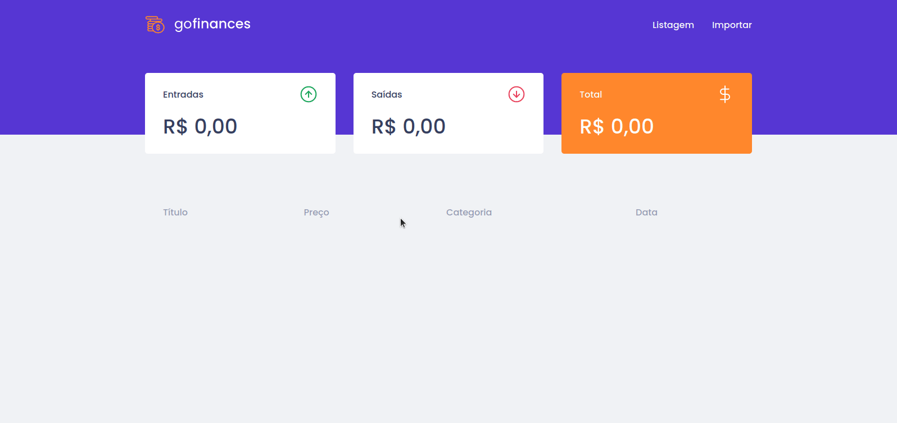

# Alfiado Constantino
<h1 align="center">
   
  GoFinance
</h1>

Aplicação de gestão de transações

  

## Descrição
Neste desafio, desenvolvi uma aplicação em Reactjs para  consumer a API do <a href="https://github.com/alfiadoDev/typeorm-upload.git">Desafio06</a>.
 
Aprendendo fundamentos do reactjs usando typescript, styled-components para estilos na nossa aplicação, upload de arquivos.

## Recursos Usados

- TypeScript
- Reactjs
- React-Router-Dom
- Axios
- Dropzone
- filesize

## Para rodar o projecto!
para rodar o projecto primeiro deve clonar o repositório e abrir a pasta no terminal e rodar os seguintes comandos: 
1. Clone o arquivo no seu terminal `https://github.com/alfiadoDev/desafio-fundamentos-reactjs.git`.
2. ainda no terminal digite o comando `cd desafio-fundamentos-reactjs` para entrar na pasta do projecto.
3. execute o comando `yarn` no terminal para instalar todas as dependências do projecto.
4. depois de terminar a instalação rodamos o comando `yarn start` para rodar o projecto no seu navegador.

## Rotas da Aplicação
- **GET /**: rota principal da aplicação para visualizar as transações feitas e o balanço.
- **GET /importar**: rota para importar arquivos CSV para adicionar novas transações

## License

This project is licensed under the MIT License - see the [LICENSE](https://opensource.org/licenses/MIT) page for details.
